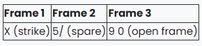
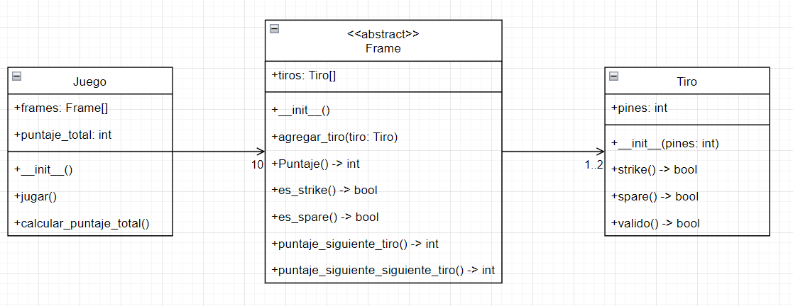

# Juego de bolos
Los bolos son un juego donde los jugadores tiran una bola pesada para tumbar unos pines organizados en forma de 
triángulo.

El objetivo del ejercicio es escribir un programa para llevar el registro del puntaje de un juego de bolos.

## Puntaje en un juego de bolos
Un juego consiste en 10 frames (cuadros). Un frame está compuesto de uno o dos tiradas de la bola (rolls) con 10 pines 
parados en el inicio del frame. Existen tres casos para la tabulación de un frame.

1) Un frame abierto (open frame) es cuando un puntaje de 10 o menos es obtenido para el frame. En este caso el puntaje 
del frame es el número de pines tumbados.  
2) Un spare es cuando los 10 pines son tumbados en el segundo lanzamiento. El valor total de un spare es 10 más el 
número de pines tumbados en el siguiente lanzamiento.  
3) Un strike es cuando los 10 pines son tumbados en el primer lanzamiento. El valor total de un strike es 10 más el 
número de pines tumbados en los siguientes dos lanzamientos. Si un strike es inmediatamente seguido por un segundo 
strike, entonces el valor del primer strike no puede ser determinado hasta que la bola sea lanzada una vez más  

Acá se presenta un ejemplo de 3 frames

-El puntaje del Frame 1 es: 10 + 5 + 5 = 20  
-El puntaje del Frame 2 es: 5 + 5 + 9 = 19  
-El puntaje del Frame 3 es: 9 + 0 = 9  
Esto quiere decir que el puntaje actual es 48.

El frame 10 en un juego es un caso especial. Si se logra un strike o un spare, entonces se obtiene un lanzamiento extra 
(fill ball). El lanzamiento extra existe para calcular el total del frame 10. Lograr un strike o spare en el 
lanzamiento extra no le da al jugador más lanzamientos extra. El valor total del frame 10 será el total de pines 
tumbados.

## Por ejemplo:

Para un frame 10 que tenga X 1/ (strike y spare), el valor total será 20.  
Para un frame 10 que tenga XXX (tres strikes), el valor total será 30.  
## Actividad  
Implemente el código necesario para llevar registro del puntaje de un juego de bolos, aplicando principios de 
orientación a objetos y teniendo en cuenta la modularización y la abstracción en el diseño.

Al finalizar, suba el enlace al repositorio con la solución del taller (incluyedo el diseño de clases)  

# Diagrama UML 

